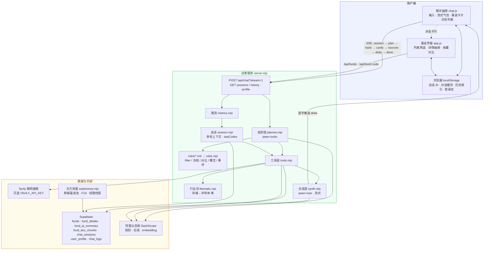
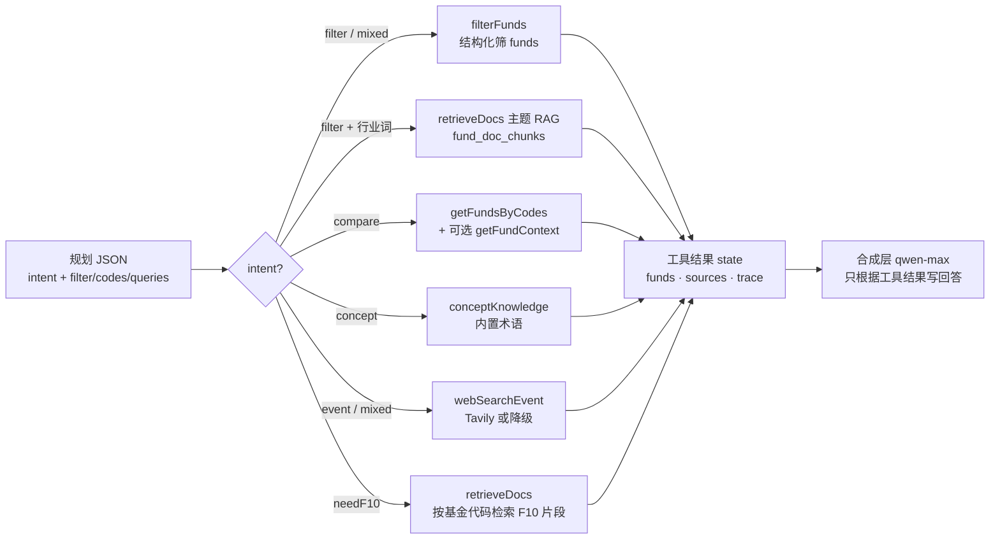
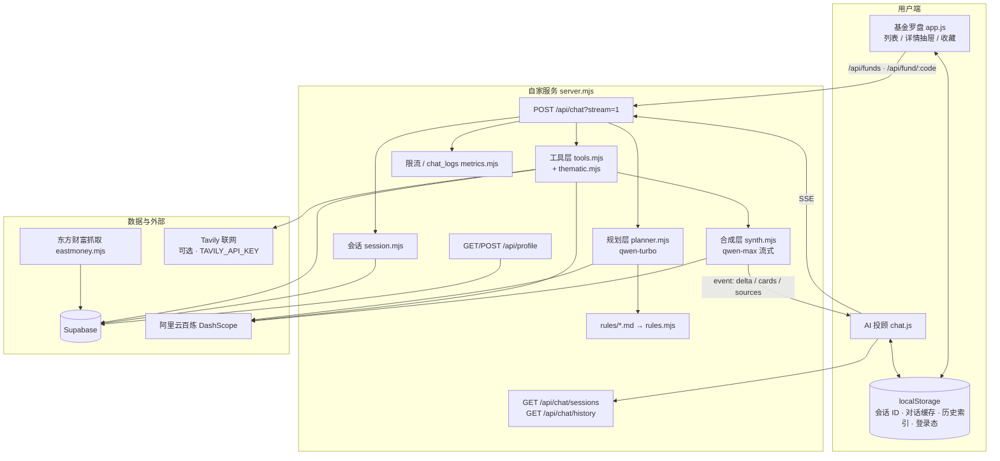
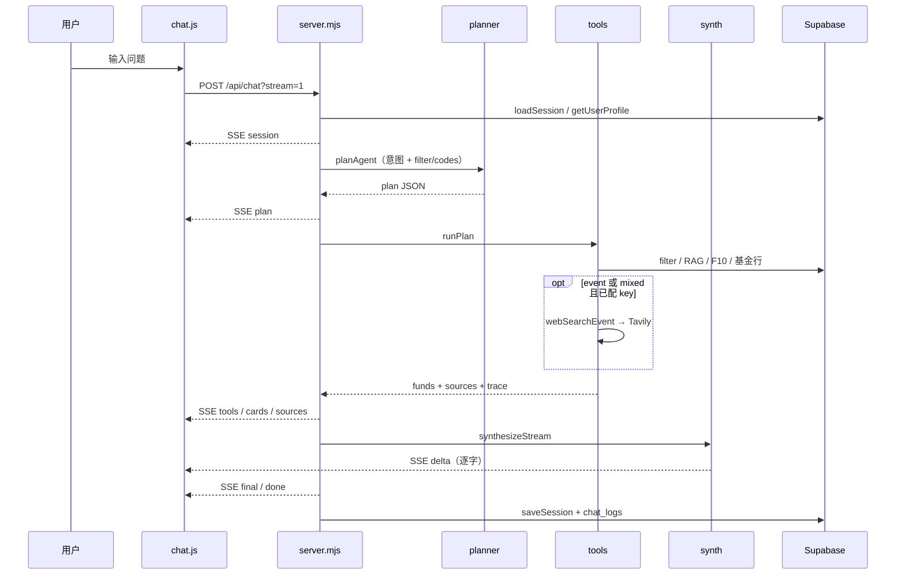

# AI 投顾 · 架构图（2026-05 现行）

> 替代早期对话里的旧版图。与 `server.mjs`、`lib/agent/*`、`public/chat.js` 实现一致。

## 升级后流程图（推荐 · 对齐旧版布局）

与早期「自家服务 → 数据 → 用户端」三张结构一致，标注已落地的能力。

### 工具层分支（按意图）

---

## 总览（模块关系简图）

## 一轮对话怎么走

## 组件职责

| 层级 | 文件 | 模型/依赖 | 做什么 |
|------|------|-----------|--------|
| **规划层** | `lib/agent/planner.mjs` | `DASHSCOPE_MODEL_FAST`（默认 qwen-turbo） | 听懂用户 → 输出 JSON 计划：`intent` / `filter` / `codes` / `conceptQuery` / `eventQuery` / `needF10` |
| **策略卡片** | `rules/*.md` + `lib/agent/rules.mjs` | — | 合规、筛选政策、对比/概念/事件话术；由 `prompts.mjs` 拼装进规划层/合成层 system |
| **工具层** | `lib/agent/tools.mjs` | Supabase、可选 Tavily、embedding | 按计划查库、RAG、联网；返回结构化结果给合成层 |
| **主题映射** | `lib/agent/thematic.mjs` | — | 「存储/半导体」等行业词 → 主题 + RAG 查询（找基场景） |
| **合成层** | `lib/agent/synth.mjs` | `DASHSCOPE_MODEL_STRONG`（默认 qwen-max） | 只根据工具结果写回答；流式 `delta` |
| **会话** | `lib/agent/session.mjs` | `chat_sessions` 表 | 多轮上下文、`lastCodes` / `lastFilters` |
| **观测** | `lib/agent/metrics.mjs` | `chat_logs` 表 | 限流、每轮 intent/耗时/降级标记 |

## 工具层一览

| 工具 | 何时调用 | 数据来源 |
|------|----------|----------|
| `filterFunds` | `filter` / `mixed` | `funds` 表结构化筛选 |
| `retrieveDocs(thematic)` | 找基 + 行业主题词 | `fund_doc_chunks` 向量检索（pgvector） |
| `retrieveDocs` | `needF10` 且已有基金代码 | 同上，可按 code 过滤 |
| `getFundsByCodes` | `compare` / 点名代码 | `funds` |
| `getFundContext` | 对比且 `needF10` | `fund_details` + `fund_ai_summary` + 净值 |
| `conceptKnowledge` | `concept` / `mixed` | 内置短知识（非 RAG） |
| `webSearchEvent` | `event` / `mixed` 且配了 `TAVILY_API_KEY` | Tavily；未配置则降级话术 |

## Supabase 表（与 Agent 相关）

| 表 | 用途 |
|----|------|
| `funds` | 基金主数据、筛选排序 |
| `fund_details` | F10 目标/范围/基准 |
| `fund_ai_summary` | 一句话 AI 点评（列表/详情展示） |
| `fund_doc_chunks` | RAG 切块 + embedding |
| `chat_sessions` | 登录用户云端会话；匿名仅本地 |
| `user_profile` | 风险偏好等软约束（规划层 filter 时参考） |
| `chat_logs` | 每轮问答审计（intent、耗时、是否降级） |
| `favorites` | 收藏（与 Agent 独立） |

## 前端 SSE 事件

`POST /api/chat?stream=1` 推送事件类型：

| event | 含义 |
|-------|------|
| `session` | 会话 ID |
| `plan` | 意图与筛选条件摘要 |
| `tools` | 工具调用 trace |
| `cards` | 基金卡片数据（可点进详情抽屉） |
| `sources` | 事件类引用链接 |
| `delta` | 回答逐字片段 |
| `final` | 完整回复文本 |
| `done` | 本轮结束 |
| `error` | 异常信息 |

非流式：同一 URL 不带 `stream=1`，一次 JSON 返回。

## 与「基金详情页」的关系

详情抽屉（`app.js` → `showDetail`）与 Agent **共用**后端数据，但 **不走** `/api/chat`：

- 净值走势、四宫格、专业指标 + AI 点评（`fund_ai_summary`）、晨星、经理档案等 → `GET /api/fund/:code`
- 列表 AI 一句话 → 批量脚本 `npm run ai:generate` 写入 `fund_ai_summary`

## 环境变量（Agent）

见根目录 `.env.example`：

- `DASHSCOPE_API_KEY` / `DASHSCOPE_MODEL_FAST` / `DASHSCOPE_MODEL_STRONG`
- `TAVILY_API_KEY`（可选，事件解读）
- `AGENT_MAX_TURNS`（会话轮数上限）

## 旧图 vs 现行差异（备忘）

| 旧图/旧说法 | 现行 |
|-------------|------|
| `rules/` 仅草稿、未接入 | **已接入** `prompts.mjs` |
| 仅 `filter` 结构化检索 | 增加 **行业主题 RAG**、`event` 时也会带候选基金 |
| 会话只写 Supabase | **localStorage 优先** + 登录用户 `chat_sessions` / `history` API |
| 无历史列表 API | 已有 `GET /api/chat/sessions` |
| 合成层非流式 | 默认 **SSE 流式** `delta` |
