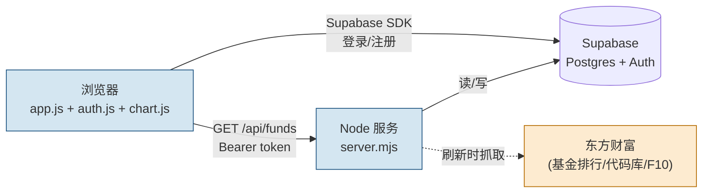

# DESIGN — QDII 基金罗盘 · Supabase 接入

## 整体架构



## 分层设计

| 层 | 文件 | 职责 |
|---|---|---|
| **入口** | `server.mjs` | HTTP 路由分发 |
| **数据采集** | `lib/eastmoney.mjs`（从 server.mjs 拆出来） | 抓东方财富数据、解析、分类、评分 |
| **持久化** | `lib/store.mjs` | 封装 Supabase 读写（funds, nav_history, fund_details） |
| **认证** | `lib/auth.mjs` | 校验 Authorization Bearer token，解出 user_id |
| **API 路由** | `server.mjs` 内联 | `/api/funds`、`/api/fund/:code`、`/api/favorites` |
| **前端展示** | `public/app.js` | 列表/筛选/对比/详情抽屉（保留现有） |
| **前端认证** | `public/auth.js` | Supabase SDK 浏览器端登录注册，存 token 到 localStorage |
| **前端图表** | `public/chart.js` | Chart.js 包装，画净值走势 |

## 数据库表结构

### funds（基金主表）
| 字段 | 类型 | 说明 |
|---|---|---|
| code | text PRIMARY KEY | 基金代码（6 位） |
| name | text NOT NULL | 基金名称 |
| pinyin | text | 拼音简称 |
| category | text | 类型（QDII 等） |
| region | text | 区域（美国/港股/全球） |
| theme | text | 主题（科技成长等） |
| fund_type | text | 指数/主动等 |
| role | text | 底仓/进攻/卫星 |
| risk | text | 高/中高/中 |
| inception | date | 成立日 |
| age_years | numeric | 成立年限 |
| buy_fee | numeric | 申购费 |
| discount_fee | numeric | 打折费率 |
| nav | numeric | 最新净值 |
| accum_nav | numeric | 累计净值 |
| nav_date | date | 净值日期 |
| return_1d/1w/1m/3m/6m/1y/2y/3y/ytd/since | numeric | 各区间收益 |
| score | int | 配置观察分 |
| score_label | text | 高关注/可观察/谨慎看待 |
| source | text | 数据来源 |
| updated_at | timestamptz | 最后更新时间 |

### nav_history（净值历史）
| 字段 | 类型 | 说明 |
|---|---|---|
| id | bigserial PK | |
| code | text NOT NULL | → funds.code |
| nav_date | date NOT NULL | 净值日期 |
| nav | numeric | 单位净值 |
| accum_nav | numeric | 累计净值 |
| recorded_at | timestamptz DEFAULT now() | 写入时间 |
| **唯一约束** | (code, nav_date) | 同日只保留一条 |

### fund_details（F10 详情缓存）
| 字段 | 类型 | 说明 |
|---|---|---|
| code | text PRIMARY KEY | → funds.code |
| goal | text | 投资目标 |
| scope | text | 投资范围 |
| benchmark | text | 业绩比较基准 |
| detail_url | text | F10 原始链接 |
| fetched_at | timestamptz | 抓取时间 |

### favorites（用户收藏）
| 字段 | 类型 | 说明 |
|---|---|---|
| id | bigserial PK | |
| user_id | uuid NOT NULL | → auth.users.id |
| code | text NOT NULL | → funds.code |
| created_at | timestamptz DEFAULT now() | |
| **唯一约束** | (user_id, code) | 不重复收藏 |

## 行级安全（RLS）
- `funds` / `nav_history` / `fund_details`：**关闭 RLS**（公开读），写入仅服务端用 secret key
- `favorites`：**开启 RLS**
  - SELECT/INSERT/DELETE：`auth.uid() = user_id`

## 接口契约

### GET /api/funds
- **Query**：`?refresh=1`（可选）
- **响应**：
```json
{
  "fetchedAt": 1715680000000,
  "fetchedAtText": "2026/5/14 20:00:00",
  "total": 386,
  "funds": [{ "code": "513100", "name": "...", "score": 82, ... }]
}
```
- **逻辑**：
  - 无 `refresh`：从 `funds` 表查全部 → 返回
  - 有 `refresh`：抓东方财富 → upsert `funds` + 追加 `nav_history` → 返回最新

### GET /api/fund/:code
- **响应**：
```json
{
  "code": "513100",
  "goal": "...",
  "scope": "...",
  "benchmark": "...",
  "navHistory": [{ "date": "2026-05-13", "nav": 1.234 }, ...],
  "analysis": { ... }
}
```
- **逻辑**：
  - 先查 `fund_details`，无则抓 F10 写库
  - 查 `nav_history` 该 code 全部，按日期升序
  - 用现有 `buildStructuredAnalysis` 生成结构化分析

### POST /api/favorites
- **Header**：`Authorization: Bearer <access_token>`
- **Body**：`{ "code": "513100" }`
- **逻辑**：用 token 解出 user_id，插入 `favorites`

### GET /api/favorites
- **Header**：`Authorization: Bearer <access_token>`
- **响应**：当前用户收藏的 code 数组

### DELETE /api/favorites/:code
- **Header**：`Authorization: Bearer <access_token>`

## 异常处理策略
| 场景 | 处理 |
|---|---|
| Supabase 不可达 | server.mjs 启动报错并退出；运行时回退现拉东方财富 |
| 东方财富抓取失败 | 返回 Supabase 已有数据 + 错误提示 |
| Token 无效 | 401，前端清 localStorage 并展示登录入口 |
| 重复收藏 | 唯一约束触发，前端忽略错误 |

## 文件变更清单（预览）

| 操作 | 路径 |
|---|---|
| 新增 | `.env`（密钥） |
| 新增 | `lib/supabase.mjs`（admin client） |
| 新增 | `lib/store.mjs`（持久化封装） |
| 新增 | `lib/auth.mjs`（token 校验） |
| 重构 | `server.mjs`（拆数据采集到 `lib/eastmoney.mjs`，新增 favorites 路由） |
| 新增 | `lib/eastmoney.mjs`（从 server.mjs 拆出） |
| 新增 | `public/auth.js` |
| 新增 | `public/chart.js`（Chart.js 封装） |
| 修改 | `public/index.html`（加登录按钮、引入 Chart.js CDN） |
| 修改 | `public/app.js`（详情页加走势图、卡片加收藏按钮） |
| 修改 | `public/styles.css`（登录弹窗、收藏按钮样式） |
| 修改 | `package.json`（加 `@supabase/supabase-js` 依赖） |
