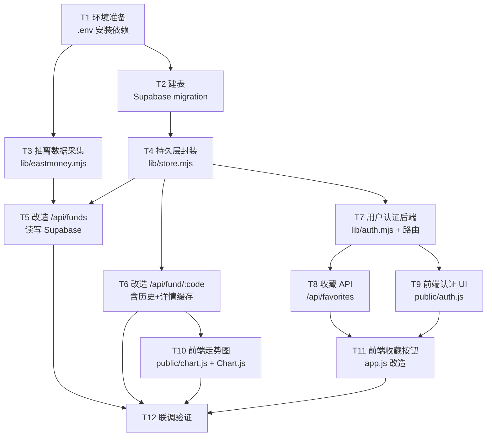

# TASK — QDII 基金罗盘 · Supabase 接入

## 任务依赖图

## 原子任务

### T1 环境准备
- **输入**：用户提供的 Supabase 凭据
- **输出**：`.env` 文件、`package.json` 加上 `@supabase/supabase-js`、`npm install` 成功
- **验收**：`node -e "import('@supabase/supabase-js').then(m => console.log(typeof m.createClient))"` 输出 `function`
- **依赖**：无

### T2 Supabase 建表
- **输入**：DESIGN 中的表结构
- **输出**：通过 MCP `apply_migration` 创建 `funds`、`nav_history`、`fund_details`、`favorites` 四张表 + RLS 策略
- **验收**：`list_tables` 返回 4 张表
- **依赖**：T1

### T3 抽离数据采集
- **输入**：现有 `server.mjs` 中的抓取/分类/评分函数
- **输出**：`lib/eastmoney.mjs` 导出 `fetchFunds()`, `fetchFundDetail()`, `classifyFund()`, `scoreFund()`, `buildStructuredAnalysis()`
- **验收**：`node -e "import('./lib/eastmoney.mjs').then(m => m.fetchFunds().then(r => console.log(r.total)))"` 输出数字
- **依赖**：T1

### T4 持久层封装
- **输入**：表结构 + 抓取数据格式
- **输出**：`lib/store.mjs` 导出：
  - `upsertFunds(funds)` — 批量 upsert 主表
  - `appendNavHistory(funds)` — 追加历史快照（同日去重）
  - `getAllFunds()` — 取全表
  - `getFundDetail(code)` — 查详情缓存
  - `saveFundDetail(code, detail)` — 写详情缓存
  - `getNavHistory(code)` — 取历史
- **验收**：单元手测脚本能 upsert 一条记录并查回来
- **依赖**：T2

### T5 改造 /api/funds
- **输入**：T3/T4 模块
- **输出**：`server.mjs` 的 `/api/funds` 路由
  - 默认：`getAllFunds()` → 若为空再现拉一次
  - `?refresh=1`：现拉 → upsertFunds + appendNavHistory → 返回最新
- **验收**：`curl localhost:5173/api/funds` 返回非空 funds 数组
- **依赖**：T3, T4

### T6 改造 /api/fund/:code
- **输入**：T4 模块
- **输出**：返回详情 + navHistory + analysis
  - 先查 `fund_details`，无则抓 F10 写库
  - 查 `nav_history` 全部
- **验收**：`curl localhost:5173/api/fund/513100` 返回含 `navHistory` 数组
- **依赖**：T4

### T7 用户认证后端
- **输入**：Supabase Auth
- **输出**：`lib/auth.mjs` 导出 `verifyToken(authHeader)` → `{ userId } | null`（用 supabase admin client 调用 `auth.getUser`）
- **验收**：传一个合法 token 返回 userId
- **依赖**：T1

### T8 收藏 API
- **输入**：T7 模块
- **输出**：`/api/favorites` GET/POST/DELETE
- **验收**：登录后能加/查/删收藏
- **依赖**：T7

### T9 前端认证 UI
- **输入**：Supabase publishable key
- **输出**：`public/auth.js`，提供登录/注册弹窗，登录成功存 token 到 localStorage，暴露 `getToken()` 函数
- **验收**：能注册新邮箱、登录、退出
- **依赖**：T7（其实独立但概念上）

### T10 前端走势图
- **输入**：Chart.js CDN、navHistory 数据
- **输出**：`public/chart.js` 导出 `renderNavChart(container, navHistory)`
- **验收**：详情页能看到一根曲线
- **依赖**：T6

### T11 前端收藏按钮
- **输入**：T8, T9
- **输出**：基金卡片增加"收藏"星标，未登录时点击提示登录
- **验收**：登录后能切换收藏状态，刷新页面依然在
- **依赖**：T8, T9

### T12 联调验证
- **输入**：以上全部
- **输出**：本地 `npm start`，浏览器走完完整流程
- **验收**：见 CONSENSUS 的 7 条验收标准
- **依赖**：T5, T6, T10, T11

## 复杂度评估
- 总体复杂度：中等
- 风险点：
  1. 东方财富抓取被限流（已有缓存兜底）
  2. Supabase Auth 邮箱验证默认开启，注册后需邮件确认（可在 dashboard 关闭让本地测试更顺）
  3. Chart.js CDN 在国内可能慢（可换成本地版或国内镜像）
