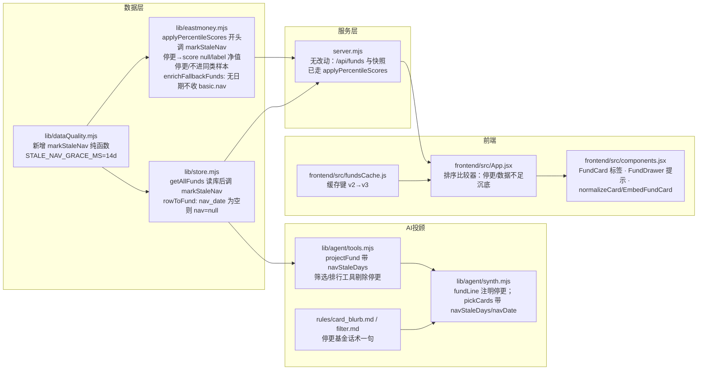

# 方案 · 净值停更标注与占位净值修复（v1.7.4）

日期：2026-09-02 · 状态：✅ 用户已批准（2026-09-02，含"数据不足"一并沉底） · 共识见 [需求共识.md](需求共识.md)

## 一、用户会看到什么

### 1. 首页列表

- 净值日期比全站最新净值日期落后 14 天以上的基金，卡片标签行多一个醒目标签「净值停更 43 天」（天数每天自动变）
- 这类基金不再有评分和同类排名，评分位置显示「净值停更」
- 不管用户选哪种排序（近 1 年收益 / 夏普 / 评级 / 规模），停更基金和"数据不足"的基金一律排在最后
- 搜索基金名或代码仍能找到它，筛选条件（地区/主题/角色）照常匹配
- 现在会命中的只有华夏恒生中国企业ETF联接 A/C（合并后一张卡）

### 2. 详情页（抽屉）

- 单位净值旁边多一行提示：「净值日期 2026-07-20 · 已停更 43 天，可能已清盘或暂停运作」
- 其它内容（持仓、费率、经理、AI 点评）照常显示

### 3. AI 投顾

- 用户问"港股基金排行 / 帮我筛选…"：停更基金不进候选名单
- 用户点名问"华夏恒生中国企业ETF联接怎么样"：会说明"该基金净值自 2026-07-20 起未再更新，可能已清盘或暂停运作，不建议关注"，聊天里的基金小卡片评分位置显示「净值停更」
- 用户问的是别的，不会主动提这件事

### 4. 占位净值（用户无感）

- 以后东财只给"1"却不给日期的份额（目前是摩根中国世纪美元现钞/现汇），不再被当成有净值：不写入库、页面按缺失处理、健康检查里算进"净值缺失"
- 库里现有的两条占位值不动，读取时自动当作缺失

### 5. 运维可见

- `/api/health` 的"净值缺失"从 8 变成 10；版本号显示 1.7.4

## 二、泼冷水

1. **14 天门槛是拍脑袋定的合理值，不是公式。** 若某基金因特殊原因（如暂停估值公告）停更超过两周，会被标"停更"并沉底，直到它恢复公布——标签会自动消失，不需要人工处理。
2. **停更基金退出同类样本后，同主题其它基金的名次会挪动 1～2 位**（港股主题 232 名之后的基金前移）。这是正确的副作用，但用户可能注意到"昨天 233 名今天 232 名"。
3. **"数据不足"基金一并沉底会改变现有排序**：目前 31 张"数据不足"卡片在按收益排序时当 0 分排在中间（正收益之后、负收益之前），这次改成排最后。这是用户拍板"和数据不足的一起"的直接结果，但属于顺带改动，若不想改请说。
4. **AI 投顾这条链路没有可用的测试账号**（`agent:test` 需要配好 Key 的用户 token），只能靠单元测试 + 代码走查保证，不能在真实聊天里跑一遍。
5. **浏览器本地缓存**：首页列表在用户浏览器里缓存 7 天。这次会换缓存版本号强制重新拉取，老用户第一次打开会多等一次加载（约 1 秒）。
6. **不清洗历史数据**：003244/003245 库里的"1"留着，靠读取时判缺失覆盖。下次刷新时如果"抓失败字段沿用上次值"逻辑把"1"沿用下来，库里仍是 1，但用户和统计都看不到它——可接受；如果用户想彻底清掉，是两行数据、零成本，说一声即可。

## 三、技术设计（写给下一个会话的 AI，用户可跳过）

### 3.1 改动落点

### 3.2 关键约定

- **停更判定是读取时现算，不落库。** `markStaleNav(funds, { graceMs })`：取列表内 `date` 最大值为参照，`参照 − 自身 date > graceMs` 的基金写 `navStaleDays`（整数天），其余 `navStaleDays = null`；缺 `date` 的不判停更（它们已因无收益走"数据不足"）。纯函数、就地打标、与 `splitDelisted` 同风格。
- **评分与停更判定同处一层。** `applyPercentileScores` 开头先 `markStaleNav`，随后把 `navStaleDays > 0` 与 `rawScore` 非有限数同等对待：`score=null`，`label="净值停更"`（区别于"数据不足"），不进 `peerCount`。这样刷新时（server.mjs `runRefreshOnce` → 落库 `score/label` 列）和读取时（`/api/funds`、快照）口径一致，AI 投顾走 `getAllFunds` 读到的落库 `label` 也是对的。
- **AI 投顾读库路径**（`tools.mjs loadFundsCached → getAllFunds`）不经过 `applyPercentileScores`，因此 `getAllFunds` 读库映射后（`splitDelisted` 之前，参照取最大值、已下架基金日期只会更旧，先后等价）也调一次 `markStaleNav`，并就地清掉停更基金的旧评分（库里存的是上次刷新的分），保证 `navStaleDays` 字段存在。重复调用幂等、740 条量级无感。
- **占位净值病根在兜底通道**：`enrichFallbackFunds` 里"基本信息渠道"只回 `DWJZ` 不回日期，"净值渠道"才给日期；原逻辑无条件收下 `basic.nav`。修法：把 1076–1098 的合并逻辑抽成纯函数 `mergeFallbackInfo(fund, basic, returns)`，规则"没有日期就不收净值"。读取层 `rowToFund` 再加一道 `nav_date` 为空则 `nav=null`，覆盖库里已有的两条。
- **前端字段透传**：列表卡片字段无白名单（`normalizeFund` 展开 `...f`），聊天卡片有两道白名单（`synth.mjs pickCards`、`components.jsx normalizeCard`）必须同时加 `navStaleDays`（和 `navDate`）。
- **排序沉底**：`App.jsx` 排序比较器先按"是否停更或 score 为 null"分组，再按用户选的键排。
- **不动数据表、不加环境变量**；门槛常量 `STALE_NAV_GRACE_MS` 放 `lib/dataQuality.mjs`，与 `DELIST_GRACE_MS` 并列。

### 3.3 测试

- `tests/data-quality.test.mjs`：`markStaleNav` 边界（恰好 14 天不算、15 天算）、全站参照（全部同步落后不算）、缺日期不算、空列表/非数组不报错
- `tests/score.test.mjs`：停更基金 `score=null`、`label="净值停更"`、不占同类样本，其余基金分位不受影响
- `tests/store.test.mjs`（新）：`rowToFund` 无日期净值 → `nav=null`
- `tests/eastmoney-fallback.test.mjs`（新）：`mergeFallbackInfo` 有日期收净值、无日期不收
- 前端无自动化测试：`npm run build` + 本地起服务 + 无头 Chrome 走查截图

## 四、为什么这么选

- 复用昨天的 `splitDelisted` 模式和"无数据不评分"的 `score=null/label` 通道，不发明新机制
- 不落库的原因：停更天数每天变，落库反而会过期；参照系是"全站最新日期"，只有拿到整个列表时才算得准
