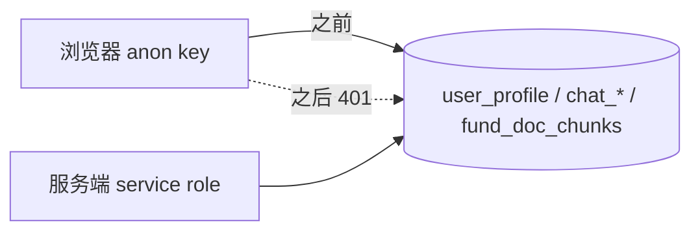

# 方案 · 安全加固 1.7.1

对应需求共识：[需求共识.md](需求共识.md)

## 总体思路

不改架构、不引框架，在现有分层里补齐"门禁、超时、兜底、可观测"四类横切能力，并把数据库结构与文档拉回和代码一致。每一处修改都在原有模式内（`server.mjs` 路由分支、`lib/*` 纯模块、`node --test` 单测），不为单个问题发明新机制。

## 1. 数据库（线上，已执行）

- 删除四条 `*_admin_all` 策略；`revoke all ... from anon, authenticated`（纵深防御）
- 删除 `consume_anon_trial()` 与 `anon_trial_usage`；修 `search_fund_doc_chunks` 的 search_path
- 迁移名 `20260901031850_lockdown_sensitive_tables_drop_anon_trial`，同名文件入仓

## 2. 服务端横切能力

| 能力 | 落点 | 设计 |
|---|---|---|
| 带状态码的错误 | `lib/http.mjs` `HttpError` | 顶层 catch 按 status 回文案；非 HttpError → 500 + 通用文案 + requestId（日志可查） |
| 客户端 IP | `clientIp()` | 服务只监听回环、由 Nginx 反代，信任 XFF 第一段 |
| 静态路径守卫 | `resolvePublicPath()` | `path.resolve` 后必须以 `public/` + 分隔符开头；越界 404 |
| 限流 | `lib/rateLimit.mjs` | 滑动窗口，key 与阈值由调用方定：登录 10/min/IP + 5/5min/邮箱；注册 5/10min/IP；后台登录 5/5min/IP；聊天 20/min/用户；Key 校验、点评重生成 6/min/用户；埋点 60/min/IP；经理页 30/min/IP |
| 刷新门禁 | `refreshAuthorized()` + `runRefreshOnce()` | token / 后台登录 / 本机直连三选一；单飞 Promise；10 分钟冷却内返回现有数据 |
| 会话归属 | `/api/chat` | sessionId 必须是 UUID；已有会话属于他人 → 403 |
| 出站超时 | `lib/fetchTimeout.mjs` | `AbortSignal.timeout` + `AbortSignal.any`；超时抛 `TimeoutError`（可换模型/重试），调用方取消保持 `AbortError` |
| 进程兜底 | `server.mjs` 末尾 | SIGTERM/SIGINT → `server.close` 最多等 10s；`uncaughtException` → 记录后退出；`unhandledRejection` → 记录 |
| 探活 | `GET /api/health` | 3s 内查 `getLastUpdatedAt()`；DB 失败返回 503 |
| 安全头 | 每个响应 | `X-Content-Type-Options` / `X-Frame-Options` / `Referrer-Policy` |

## 3. 数据层

- `parseFundRow`：字段数 < 21 或代码非 6 位 → `null`；整批为 0 → 抛错中止刷新
- 抓取函数非 2xx → 抛错（费率/持仓/资产配置/风险指标/评级/净值历史/基本信息/历史净值脚本）
- `lib/navValidation.mjs`：净值 ≤ 0 / 日期异常不入库；`saveNavHistoryRows` 分片 200

## 4. 数据库结构入仓

`supabase/migrations/` = 线上 24 条原样导出 + `events` 补录 + 本次收口；`supabase/README.md` 写明重放方式与新增规矩。

## 5. 前端

- `frontend/src/api.js`：统一 `api(path, {auth, timeout, signal, body})`，401 自动登出
- `auth.js`：存储写失败吞掉；token 过期本地判定；`init()` 先恢复登录态再拉配置
- `App.jsx`：筛选/排序 `useMemo`
- `components.jsx`：SSE 用 `AbortController`，断线保留已有内容；详情/经理请求可取消；`renderFund.code` 修复；卡片键盘可达；删 `CountUp` / `Sparkline`
- `Admin.jsx`：`af()` 返回 JSON 且抛错；各页加载失败可见
- `main.jsx`：错误边界不再把堆栈渲染给用户

## 6. 工程

- `package.json`：`test` 脚本、`engines.node >= 20.6`、版本 1.7.1
- `git tag` 补 v1.5.0 / v1.6.0 / v1.7.0
- 文档：CLAUDE.md / README.md / AGENTS.md / CHANGELOG.md / .env.example / ARCHITECTURE.md / 开发进度跟踪.md

## 风险与回滚

- 数据库策略删除：如需回滚，`supabase/migrations/2026051504*.sql` 与 `20260515050026_*.sql` 里保留了原策略语句（但**不建议**恢复）
- 刷新门禁：若服务器 Nginx 未设置 `X-Forwarded-For`，公网请求会被当成本机直连——请尽快在服务器 `.env` 配 `DATA_REFRESH_TOKEN`，配上后本机直连豁免自动失效
- 抓取改为抛错：`refreshFunds` 的各阶段本就有 try/catch，单只基金失败不影响整体；但排行接口整批漂移会让刷新失败并保留旧数据（这是预期）
