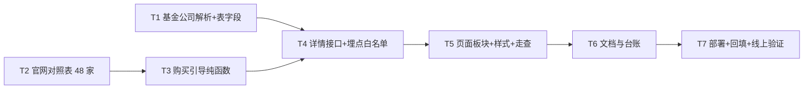

# 任务清单 · 购买引导（去哪里买）

日期：2026-09-03　状态：✅ 用户已批准（2026-09-03），施工中　方案：`方案.md`

每个任务：先写会失败的测试 → 实现 → 跑 `npm test` → 自审 → 独立复查 → 勾掉。一次只做一个。

## T1 基金公司解析 + 表字段（后端）

- 输入：东财 F10 概况页 HTML（今天已核实 741/741 含「基金管理人」链接）
- 做：`parseFundCompany(html)` 纯函数（返回 `{ id, name }` 或 null）→ `fetchFundProfile` 带出 `companyId / companyName` → `saveFundDetail` 写库 → 迁移文件 `supabase/migrations/20260903..._add_company_to_fund_details.sql`（两列可空）→ `scripts/backfill-fund-details.mjs` 结束时打印「无官网对照的公司」
- 测试：`tests/eastmoney-parse.test.mjs` 新增 3 条（正常 / 无管理人 / 链接格式漂移）
- 验收：`npm test` 全绿；本地对 1 只基金跑 `fetchFundProfile` 拿到 `{ id, name }`
- 备注：迁移**先在线上应用**（T7）再部署代码；本地 `.env` 连的也是线上库，T1 只加文件不应用

## T2 官网对照表（数据）

- 输入：48 家公司 id + 名称（今天探针结果，见方案附录）
- 做：逐家搜索官网 → 程序 HEAD/GET 核实 200 → 写 `lib/data/fund-companies.json`（附 `verifiedAt`）→ 表格贴给用户过目
- 测试：`tests/fund-companies.test.mjs`（格式 / https / 无重复 / 48 条都在）
- 验收：48/48 可访问；用户看过表格
- 并行：与 T1 无依赖

## T3 购买引导纯函数（后端）

- 输入：T2 的对照表
- 做：`lib/purchaseGuide.mjs buildPurchaseGuide(fund, detail, table)` 按方案 §3.1 输出
- 测试：`tests/purchase-guide.test.mjs`（开放 / 限购 / 场内 / 暂停 / 封闭 / 未知 / 无对照 / 代码非法 共 8 条）
- 验收：`npm test` 全绿

## T4 详情接口 + 埋点白名单（后端）

- 依赖：T1、T3
- 做：`server.mjs` 详情响应加 `purchaseGuide`；`/api/events` 白名单加 `buy_click`；后台统计 `typeTotals` 加 `buy_click`；`Admin.jsx` 加「点击购买渠道」一行
- 验收：本地起服务 `curl /api/fund/019454` 看到 `purchaseGuide`（限购）、`/api/fund/513310`（场内）；`POST /api/events` 送 `buy_click` 返回 2xx

## T5 页面板块 + 样式 + 走查（前端）

- 依赖：T4
- 做：`components.jsx` 交易规则区块加「去哪里买」；`compass.css` 样式；`track("buy_click")`
- 验收：`npm run build` + 本地起服务 + Playwright 走查 4 种状态各一只（开放 / 限购 / 暂停 / 场内），控制台无本站报错（手机端适配本期不做，用户 2026-09-03 拍板：主做 Web）；截图存 `docs/购买引导/截图/`

## T6 文档与台账

- 做：`CHANGELOG.md`（1.8.0 待定）、`CLAUDE.md`（表字段 / 接口面 / 对照表说明）、`docs/购买引导/验收记录.md`、`docs/开发进度跟踪.md` 登记
- 验收：台账能查到本任务、拍板口径、自测证据

## T7 部署 + 回填 + 线上验证（**须用户指示后执行**）

- 做：线上应用迁移 → 备份 → rsync 部署 → `pm2 restart funds --update-env` → 服务器 `FORCE=1 npm run data:f10` 回填 → 核对 `company_id` 空值 0 → 生产 Playwright 抽查 → 台账登记完成时间
- 备注：发版号与推送 GitHub 另行请示

## 附录 · 48 家基金公司（2026-09-03 探针，按基金数）

易方达 73 · 华夏 60 · 广发 54 · 汇添富 42 · 嘉实 39 · 南方 38 · 富国 38 · 摩根(中国) 37 · 华安 34 · 博时 31 · 大成 24 · 华泰柏瑞 21 · 天弘 18 · 华宝 17 · 景顺长城 15 · 工银瑞信 15 · 银华 14 · 建信 14 · 鹏华 13 · 招商 13 · 中欧 12 · 国泰 11 · 长城 10 · 国海富兰克林 10 · 中银 9 · 万家 7 · 宝盈 6 · 交银施罗德 6 · 国泰海通资管 6 · 创金合信 6 · 诺安 5 · 融通 4 · 宏利 4 · 长信 4 · 海富通 3 · 光大保德信 3 · 汇丰晋信 3 · 平安 3 · 长盛 2 · 申万菱信 2 · 中信保诚 2 · 浦银 2 · 东方红资管 2 · 西部利得 2 · 兴业 2 · 永赢 2 · 华泰证券(上海)资管 2 · 国投瑞银 1
