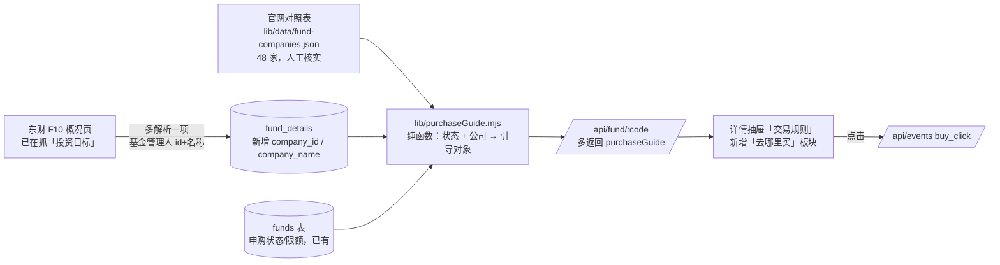

# 方案 · 购买引导（去哪里买）

日期：2026-09-03　状态：✅ 用户已批准（2026-09-03）

## 一、整体思路

三块拼起来：**基金公司是谁**（新数据）→ **官网在哪**（一张 48 行的对照表）→ **现在能不能买、去哪买**（一个纯函数算出来给页面）。全部复用现有抓取通道和详情接口，不新增外部依赖。



## 二、数据层

### 2.1 基金公司字段（唯一的表结构改动）

- 迁移文件 `supabase/migrations/20260903xxxxxx_add_company_to_fund_details.sql`：`fund_details` 增加 `company_id text`、`company_name text`（可空，纯追加，不影响现有代码）。
- `lib/eastmoney.mjs fetchFundProfile`：从同一张概况页多解析「基金管理人」（页面片段 `基金管理人</th><td><a href="//fund.eastmoney.com/company/80055334.html">华泰柏瑞基金</a>`），今天 741/741 解析成功。解析函数独立可测。
- `lib/store.mjs saveFundDetail` 写入两列。
- **回填**：现有 `FORCE=1 npm run data:f10` 重抓所有基金概况页即可带上公司（741 页，约 2–3 分钟，只抓东财、不用 AI、不花钱）。同时打印「哪些公司没有官网对照」。
- 新基金：首次打开详情就会抓概况页落库，公司字段自动补上；只有「刚上架、从没人打开过」的第一次打开看不到官网按钮，第二次就有。

### 2.2 官网对照表

- 文件 `lib/data/fund-companies.json`，键是东财公司 id，值是 `{ name, site }`。48 家，一次性用搜索逐家找官网、程序验证可访问（HTTP 200），再列表给用户过目。
- 为什么用文件不用表：公司官网几年不变，48 行随代码版本管理即可；不需要运营界面。
- 不在表里的公司：页面只给天天基金按钮 + 「请搜索「XX基金」官网」提示，绝不给猜出来的链接。

## 三、服务层

### 3.1 `lib/purchaseGuide.mjs`（纯函数，可单测）

输入：基金代码、申购状态（开放 / 限购 / 暂停 / 场内交易 / 封闭）、限购额度、公司 id / 名称、对照表。输出：

```
{
  mode: "open" | "limit" | "exchange" | "paused" | "closed",
  canBuy: true/false,                       // 暂停 / 封闭 → false，按钮置灰
  note: "限购 100 元/日，可通过以下渠道申购",   // 状态一句话
  channels: [
    { key: "ttfund",   label: "天天基金",     url: "https://fund.eastmoney.com/019454.html" },
    { key: "official", label: "华泰柏瑞基金官网", url: "https://www.huatai-pb.com/" }   // 无对照时不出现，改为 officialHint
  ],
  officialHint: null | "基金公司官网：请搜索「XX基金」",
  disclaimer: "本站不销售基金，以上为第三方销售平台 / 基金公司页面，跳转后与本站无关；投资有风险，请自行核实。"
}
```

状态文案：

| 申购状态 | note | canBuy |
|---|---|---|
| 开放 | 开放申购，可通过以下渠道申购 | ✓ |
| 认购期 | 认购期内，可通过以下渠道认购 | ✓ |
| 限购 | 限购 N 元/日，可通过以下渠道申购 | ✓ |
| 场内交易 | 场内基金，请在券商 App 输入代码 XXXXXX 买卖；以下链接仅供查看资料 | ✓（链接可点） |
| 暂停 | 当前暂停申购，暂不能买入（按钮置灰不可点） | ✗ |
| 封闭 | 封闭期内暂不能申购（按钮置灰不可点） | ✗ |
| 无数据 | 申购状态暂无数据，请以渠道页面为准 | ✓ |
| 有值但不认识 | 当前状态「原文」，请以渠道页面为准 | ✓ |

### 3.2 接口

- `GET /api/fund/:code` 响应多一个字段 `purchaseGuide`（由列表快照里的申购状态 + `fund_details` 公司字段算出，不额外查库、不额外抓取）。
- `POST /api/events` 允许的事件类型加 `buy_click`；后台行为分析的类型汇总加「点击购买渠道」一项（`server.mjs` 统计 + `Admin.jsx` 一行标签）。

## 四、页面层

- `components.jsx` 详情抽屉「交易规则」区块：申购状态条下方新增 `.buy-guide` 板块——标题「去哪里买」、状态行、渠道按钮（`<a target="_blank" rel="noopener noreferrer">`；`canBuy=false` 时渲染为置灰的不可点元素）、官网缺失提示、免责声明小字。
- 详情还没加载完时不显示该板块（沿用现有「先秒回、再补全」的方式，接口返回后出现）。
- 点击按钮调用 `track("buy_click", { code, label: 渠道 })`，失败不影响跳转。
- `compass.css` 新增 `.buy-guide*` 样式，沿用现有 token。手机端（H5）适配本期不做（用户 2026-09-03 拍板：主做 Web）。

## 五、异常与降级

- 概况页解析不到基金管理人 → 公司字段留空，页面走「无对照」分支，不报错。
- 对照表里的官网将来失效 → 用户点过去 404；对照表附核实日期，验收记录里写明「每半年复核一次」。
- 申购状态缺失 → 「未知」文案，按钮仍可点，让渠道页面说话。
- 埋点失败不影响跳转（现有 `track` 已是 fire-and-forget）。

## 六、测试

- `tests/eastmoney-parse.test.mjs`：基金管理人解析（正常 / 缺失 / 格式漂移返回 null）。
- `tests/purchase-guide.test.mjs`：五种状态 + 未知状态 + 无对照表 + 代码非法。
- `tests/fund-companies.test.mjs`：对照表每条有 name、site 为 https 开头、id 为数字串、无重复。
- 页面：`npm run build` + 本地起服务 + Playwright 走查（开放 / 限购 / 暂停 / 场内 各一只）。
- 数据：部署后 `FORCE=1 npm run data:f10` 回填，核对 `company_id` 空值数 = 0（741 只）。

## 七、影响范围

- 改动文件：`lib/eastmoney.mjs`、`lib/store.mjs`、`lib/purchaseGuide.mjs`（新）、`lib/data/fund-companies.json`（新）、`server.mjs`（详情响应 + 事件白名单 + 后台统计）、`frontend/src/components.jsx`、`frontend/src/compass.css`、`frontend/src/Admin.jsx`、`supabase/migrations/`（新）、`scripts/backfill-fund-details.mjs`（打印缺官网对照的公司）、测试 3 个、`CHANGELOG.md` / `CLAUDE.md` / 台账 / 验收记录。
- 性能：详情接口只多做一次内存计算；每日刷新不受影响；回填一次性 741 次东财请求。
- 版本：这是「现在你可以从详情页直接跳到购买渠道了」的新能力，建议作为 **v1.8.0**；发版与部署仍按规矩先请示。

## 八、不做 / 留待以后

- 列表卡片与 AI 投顾卡片入口（用户拍板本期不做；纯函数已可复用，将来加只改页面）。
- 支付宝 / 券商 App 深链接。
- 官网直达某只基金购买页（各家格式不统一，不可靠）。
